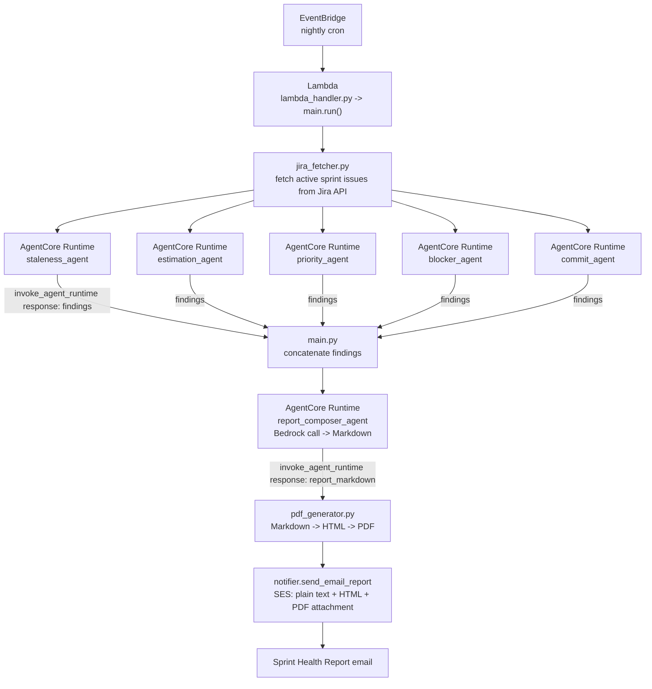
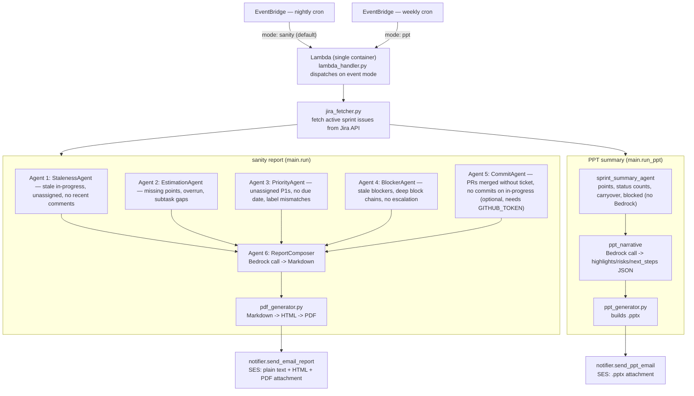

# Jira Sanity Checker

**Built on AWS Bedrock AgentCore.** The 6 agents that power the nightly sprint-health report — StalenessAgent, EstimationAgent, PriorityAgent, BlockerAgent, CommitAgent, and the Bedrock-powered ReportComposer — each run as their own independently deployed **AgentCore Runtime**: a containerized agent with its own ECR image, its own least-privilege IAM role, invoked over `bedrock-agentcore:InvokeAgentRuntime`. Six agents, six runtimes, visible individually in `aws bedrock-agentcore-control list-agent-runtimes`.

Alongside that: a weekly PPT summary (stats + Bedrock narrative → slide deck email). Both flows deliver via AWS SES, fully automated, no dashboards, no manual standup prep — just email.

---

## Powered by AWS Bedrock AgentCore



Each runtime is its own ARM64 container (`agentcore/<name>/`), built and registered independently via `scripts/deploy_agentcore_agents.py`, backed by its own ECR repo + IAM role (`infra/agentcore.tf`) so permissions stay least-privilege per agent — only `commit_agent` gets the GitHub secret, only `report_composer_agent` gets `bedrock:InvokeModel`. Flip it on with `AGENT_BACKEND=agentcore` (see [AgentCore Runtime](#agentcore-runtime) below for the full bootstrap). A `local` in-process mode still exists as the default/dev fallback — same code, same findings contract, no network hop — but AgentCore is the deployment model this project is built around.

---

## How It Works



Every sanity agent is a pure Python function: `run(issues: list[dict]) -> list[dict]`. No network calls except the Commit agent (GitHub API, optional). Everything runs in the same Lambda invocation — no fan-out, no queues. Delivery is unconditional (no human approval gate); `dry_run=True` skips the SES send when run locally via `main.py`.

**Two backends for Agents 1-6, switched by `AGENT_BACKEND`:**
- `agentcore` — the star of this repo: each of the 6 agents runs as its own **AWS Bedrock AgentCore Runtime** (a separately-deployed ARM64 container, one per agent), invoked over the network via `boto3.client("bedrock-agentcore").invoke_agent_runtime(...)`. Same code, same findings contract — see `agentcore/` and `scripts/deploy_agentcore_agents.py`, and the full setup in [AgentCore Runtime](#agentcore-runtime) below.
- `local` (default, dev fallback) — the diagram above; everything runs in-process inside the Lambda, no AgentCore involved.

The PPT flow always runs locally regardless of this switch.

---

## Agents

| # | Agent | What it does |
|---|---|---|
| 1 | **StalenessAgent** | Flags tickets In Progress / In Review with no comment in N days (default 3); unassigned in-progress; tickets untouched since sprint start |
| 2 | **EstimationAgent** | Flags missing story points on In Progress or closed tickets; completed tickets that overran estimate by >50%; subtasks with no estimate when parent has one |
| 3 | **PriorityAgent** | Flags P1 tickets with no assignee; P1/P2 with no due date; tickets whose labels conflict with priority field; orphaned escalation labels |
| 4 | **BlockerAgent** | Flags blocked tickets with no comment in 3 days; blocked tickets with no escalation comment; blocker chains deeper than 2 hops |
| 5 | **CommitAgent** | Flags in-progress tickets with no linked commits or PRs; merged PRs with no Jira key in branch/title (requires `GITHUB_TOKEN`) |
| 6 | **ReportComposer** | Not a finding-agent — takes all findings from Agents 1-5 and makes a single Bedrock call to compose the final Markdown report |

Agents 1-5 share the same contract: `run(issues: list[dict]) -> list[dict]`, each finding with `agent`, `key`, `severity`, `reason`, `url`. Tickets labelled `sanity-ignore` are skipped by all of them.

---

## Report

Bedrock composes a structured Markdown report from all findings. The email delivers three formats simultaneously:

- **Plain text** — readable in any mail client
- **HTML** — formatted, severity-colored inline
- **PDF attachment** — `sprint-health-<sprint>.pdf`, generated by weasyprint, printable

Severity levels: `HIGH` (red), `MEDIUM` (amber), `LOW` (blue).

---

## Project Structure

```
src/
  jira_fetcher.py         # Jira client + issue normalization (21-key schema)
  pdf_generator.py        # Markdown → HTML → PDF via weasyprint (sanity report)
  ppt_generator.py        # Builds the .pptx from stats + narrative (PPT flow)
  notifier.py             # SES: send_email_report (sanity) + send_ppt_email (PPT)
  agentcore_agents.py      # AGENT_BACKEND=agentcore invoke_agent_runtime wrappers
  main.py                 # CLI entry point — run() (sanity) / run_ppt() (PPT)
  lambda_handler.py        # Lambda handler — dispatches on event["mode"]
  agents/
    staleness_agent.py
    estimation_agent.py
    priority_agent.py
    blocker_agent.py
    commit_agent.py
    report_composer.py    # Bedrock call -> Markdown
    sprint_summary_agent.py  # pure aggregation for the PPT flow, no Bedrock
    ppt_narrative.py       # Bedrock call -> {highlights, risks, next_steps} JSON

agentcore/                # AGENT_BACKEND=agentcore: one deployable container per agent
  staleness/               # agent.py (FastAPI /invocations + /ping) + Dockerfile (ARM64) + requirements.txt
  estimation/
  priority/
  blocker/
  commit/
  report_composer/

scripts/
  seed_demo_stories.py     # bulk-create Jira tickets crafted to trip every sanity finding
  deploy_agentcore_agents.py  # build/push/register the 6 AgentCore Runtimes

infra/
  main.tf                 # Provider, caller identity
  ecr.tf                  # Main Lambda's ECR repo
  agentcore.tf             # 6 ECR repos + 6 IAM roles for the AgentCore runtimes
  iam.tf                   # Lambda role: Bedrock, SES, Secrets Manager, ECR, X-Ray, InvokeAgentRuntime
  secrets.tf               # Secrets Manager: JIRA_API_TOKEN, GITHUB_TOKEN
  scheduler.tf              # Lambda + two EventBridge crons (nightly sanity, weekly PPT)
  observability.tf          # CloudWatch log group, metric filters, alarms, dashboard
  variables.tf
  outputs.tf

tests/
  fixtures/
    sprint_issues.json     # 12-issue canonical fixture (most agent tests use this)
  test_staleness_agent.py
  test_estimation_agent.py
  test_priority_agent.py
  test_blocker_agent.py
  test_commit_agent.py
  test_sprint_summary_agent.py
  test_ppt_narrative.py
  test_ppt_generator.py
  test_agentcore_wrappers.py   # tests agentcore/*/agent.py via FastAPI TestClient
  test_jira_fetcher.py
  test_main.py
  test_main_ppt.py
  test_notifier_ppt.py
  test_lambda_handler.py
```

---

## Local Development

### Prerequisites

- Python 3.12
- Jira API token ([create here](https://id.atlassian.com/manage-profile/security/api-tokens))
- AWS credentials (for Bedrock + SES)

### Setup

```bash
python3.12 -m venv .venv && source .venv/bin/activate
pip install -r requirements-dev.txt   # requirements.txt + fastapi/httpx/uvicorn (needed for agentcore/ wrapper tests)
cp .env.example .env
# edit .env with your Jira URL, email, token, project key, SES addresses
```

### Run against live Jira

```bash
PYTHONPATH=src python src/main.py "Sprint 42"
```

### Dry run (no email, no prompt)

```bash
PYTHONPATH=src python src/main.py "Sprint 42" --dry-run
```

### Tests

```bash
pytest tests/ -v
pytest tests/test_staleness_agent.py::test_stale_in_progress_detected -v
```

### Docker (loads `.env` automatically)

```bash
docker compose run app
```

---

## Environment Variables

| Variable | Required | Description |
|---|---|---|
| `JIRA_URL` | Yes | `https://yourcompany.atlassian.net` |
| `JIRA_EMAIL` | Yes | Atlassian account email |
| `JIRA_API_TOKEN` | Yes (local) | Atlassian API token |
| `JIRA_API_TOKEN_SECRET_ARN` | Yes (Lambda) | Secrets Manager ARN — takes priority over env var |
| `JIRA_PROJECT_KEY` | Yes | e.g. `ENG` |
| `EMAIL_FROM` | Yes | Verified SES sender address |
| `EMAIL_RECIPIENTS` | Yes | Comma-separated recipient addresses |
| `JIRA_STALENESS_THRESHOLD_DAYS` | No | Days before ticket flagged stale (default `3`) |
| `JIRA_STORY_POINTS_FIELD` | No | Custom field ID (default `customfield_10016`) |
| `JIRA_IGNORE_LABEL` | No | Label to skip ticket in all agents (default `sanity-ignore`) |
| `GITHUB_TOKEN` | No | PAT for commit correlation agent — skipped if unset |
| `GITHUB_REPO` | No | `owner/repo` for GitHub API calls |
| `AWS_REGION` | No | Bedrock + SES region (default `us-east-1`) |
| `AGENT_BACKEND` | No | `local` (default) or `agentcore` — see [AgentCore Runtime](#agentcore-runtime) below |
| `AGENTCORE_STALENESS_ARN` / `_ESTIMATION_ARN` / `_PRIORITY_ARN` / `_BLOCKER_ARN` / `_COMMIT_ARN` / `_REPORT_COMPOSER_ARN` | Only if `AGENT_BACKEND=agentcore` | AgentCore Runtime ARN for each agent |

---

## Deployment

### 1. Build and push image

```bash
AWS_ACCOUNT=123456789012
AWS_REGION=us-east-1
ECR_URL=$AWS_ACCOUNT.dkr.ecr.$AWS_REGION.amazonaws.com/jira-sanity-checker

aws ecr get-login-password --region $AWS_REGION | \
  docker login --username AWS --password-stdin $ECR_URL

docker build --platform linux/arm64 -t $ECR_URL:latest .
docker push $ECR_URL:latest
```

### 2. Configure variables

```bash
cp infra/terraform.tfvars.example infra/terraform.tfvars
# edit infra/terraform.tfvars — fill in all required values
```

`infra/terraform.tfvars` is gitignored. Never commit it.

### 3. Provision infrastructure

```bash
cd infra
terraform init
terraform apply
```

Terraform provisions: ECR, Lambda (container image, 300s timeout), two EventBridge crons, IAM role, Secrets Manager secrets, CloudWatch log group + metric filters + alarms + dashboard — plus (from `infra/agentcore.tf`) 6 more ECR repos and 6 IAM roles for the optional AgentCore backend (see [AgentCore Runtime](#agentcore-runtime) below; the runtimes themselves aren't Terraform-managed).

### 4. Verify

```bash
aws lambda invoke \
  --function-name jira-sanity-checker \
  --payload '{"project_key":"ENG","sprint_name":"Sprint 42","dry_run":true}' \
  --cli-binary-format raw-in-base64-out \
  response.json && cat response.json
```

---

## AgentCore Runtime

How to stand up the 6 AgentCore Runtimes that this project is built around — each of the 6 sanity-report agents deployed as its own ARM64 container (`POST /invocations` + `GET /ping`), visible in `aws bedrock-agentcore-control list-agent-runtimes`.

First-time setup (in order):

```bash
# 1. Provision the 6 ECR repos + 6 IAM roles (agentcore_runtime_arns defaults to {})
cd infra && terraform apply

# 2. Build, push, and register the 6 runtimes — prints their ARNs
cd .. && python scripts/deploy_agentcore_agents.py

# 3. Paste the printed ARNs into infra/terraform.tfvars under agentcore_runtime_arns,
#    then wire the Lambda's IAM permission + env vars
cd infra && terraform apply

# 4. Flip infra/terraform.tfvars: agent_backend = "agentcore", then
terraform apply
# ...and rebuild/redeploy the main Lambda image (step 1 of Deployment above)
# so it actually contains the updated src/ (agentcore_agents.py, main.py).
```

Gotcha: the `bedrock-agentcore:InvokeAgentRuntime` IAM grant needs **both** the bare runtime ARN and its `/*` wildcard — AWS authorizes against the runtime ARN itself and its `runtime-endpoint/DEFAULT` sub-resource separately.

The PPT flow (`--ppt`) is not part of this backend switch — it always runs locally.

---

## AWS Services Used

| Service | Purpose |
|---|---|
| **Bedrock AgentCore** | **Hosts the 6 sanity agents as individual runtimes** (`AGENT_BACKEND=agentcore`) — the core architecture of this project |
| Lambda | Orchestrator: fetches Jira, invokes the 6 AgentCore Runtimes, emails the result |
| ECR | Container image registry (main Lambda + 6 AgentCore images) |
| Bedrock | Report/narrative composition (`us.anthropic.claude-sonnet-4-5-20250929-v1:0`) |
| EventBridge | Two cron triggers: nightly sanity report, weekly PPT summary |
| SES | Email delivery (plain + HTML + PDF, and `.pptx`) |
| Secrets Manager | JIRA_API_TOKEN and GITHUB_TOKEN at rest |
| CloudWatch | Logs, metric filters, alarms, dashboard |
| X-Ray | Distributed tracing |

---

## CI

GitHub Actions runs `pytest tests/ -v` on every push and pull request to `main`. See `.github/workflows/ci.yml`.

---

## License

MIT — see `LICENSE`.
