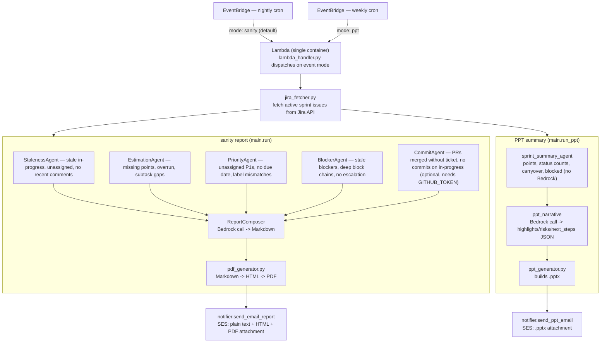

# Jira Sanity Checker

Sprint hygiene tool. One Lambda, two scheduled jobs sharing the same Jira fetch: a **nightly sanity report** (5 analysis agents → Bedrock-composed Markdown → PDF email) and a **weekly PPT summary** (stats + Bedrock narrative → slide deck email). Both deliver via AWS SES, fully automated.

No dashboards. No manual standup prep. Just email.

---

## How It Works



Every sanity agent is a pure Python function: `run(issues: list[dict]) -> list[dict]`. No network calls except the Commit agent (GitHub API, optional). Everything runs in the same Lambda invocation — no fan-out, no queues. Delivery is unconditional (no human approval gate); `dry_run=True` skips the SES send when run locally via `main.py`.

---

## Agents

| Agent | What it flags |
|---|---|
| **StalenessAgent** | Tickets In Progress / In Review with no comment in N days (default 3); unassigned in-progress; tickets untouched since sprint start |
| **EstimationAgent** | Missing story points on In Progress or closed tickets; completed tickets that overran estimate by >50%; subtasks with no estimate when parent has one |
| **PriorityAgent** | P1 tickets with no assignee; P1/P2 with no due date; tickets whose labels conflict with priority field; orphaned escalation labels |
| **BlockerAgent** | Blocked tickets with no comment in 3 days; blocked tickets with no escalation comment; blocker chains deeper than 2 hops |
| **CommitAgent** | In-progress tickets with no linked commits or PRs; merged PRs with no Jira key in branch/title (requires `GITHUB_TOKEN`) |

Tickets labelled `sanity-ignore` are skipped by all agents.

---

## Report

Bedrock composes a structured Markdown report from all findings. The email delivers three formats simultaneously:

- **Plain text** — readable in any mail client
- **HTML** — formatted, severity-colored inline
- **PDF attachment** — `sprint-health-<sprint>.pdf`, generated by weasyprint, printable

Severity levels: `HIGH` (red), `MEDIUM` (amber), `LOW` (blue).

---

## Project Structure

```
app/
  Orchestrator/          # Lambda entry point — Dockerfile, main.py, pyproject.toml
  StalenessAgent/        # Agent code + standalone Dockerfile for local dev
  EstimationAgent/
  PriorityAgent/
  CommitAgent/
  BlockerAgent/
  ReportComposer/

src/
  jira_fetcher.py        # Jira client + issue normalization (21-key schema)
  pdf_generator.py       # Markdown → HTML → PDF via weasyprint
  notifier.py            # SES multipart email sender
  main.py                # CLI entry point (local dev)
  lambda_handler.py      # Lambda handler (delegates to main.run)
  agents/
    staleness_agent.py
    estimation_agent.py
    priority_agent.py
    blocker_agent.py
    commit_agent.py
    report_composer.py   # Bedrock call

infra/
  main.tf                # Provider, caller identity
  ecr.tf                 # Single ECR repo
  iam.tf                 # Lambda role: Bedrock, SES, Secrets Manager, ECR, X-Ray
  secrets.tf             # Secrets Manager: JIRA_API_TOKEN, GITHUB_TOKEN
  scheduler.tf           # Lambda + EventBridge cron (2 AM UTC)
  observability.tf       # CloudWatch log group, metric filters, alarms, dashboard
  variables.tf
  outputs.tf

tests/
  fixtures/
    sprint_issues.json   # 12-issue canonical fixture (all agent tests use this)
  test_staleness_agent.py
  test_estimation_agent.py
  test_priority_agent.py
  test_blocker_agent.py
  test_commit_agent.py
  test_fetcher.py
```

---

## Local Development

### Prerequisites

- Python 3.12
- Jira API token ([create here](https://id.atlassian.com/manage-profile/security/api-tokens))
- AWS credentials (for Bedrock + SES)

### Setup

```bash
python3.12 -m venv .venv && source .venv/bin/activate
pip install -r requirements.txt
cp .env.example .env
# edit .env with your Jira URL, email, token, project key, SES addresses
```

### Run against live Jira

```bash
PYTHONPATH=src python src/main.py "Sprint 42"
```

### Dry run (no email, no prompt)

```bash
PYTHONPATH=src python src/main.py "Sprint 42" --dry-run
```

### Tests

```bash
pytest tests/ -v
pytest tests/test_staleness_agent.py::test_stale_in_progress_detected -v
```

### Docker (loads `.env` automatically)

```bash
docker compose run app
```

---

## Environment Variables

| Variable | Required | Description |
|---|---|---|
| `JIRA_URL` | Yes | `https://yourcompany.atlassian.net` |
| `JIRA_EMAIL` | Yes | Atlassian account email |
| `JIRA_API_TOKEN` | Yes (local) | Atlassian API token |
| `JIRA_API_TOKEN_SECRET_ARN` | Yes (Lambda) | Secrets Manager ARN — takes priority over env var |
| `JIRA_PROJECT_KEY` | Yes | e.g. `ENG` |
| `EMAIL_FROM` | Yes | Verified SES sender address |
| `EMAIL_RECIPIENTS` | Yes | Comma-separated recipient addresses |
| `JIRA_STALENESS_THRESHOLD_DAYS` | No | Days before ticket flagged stale (default `3`) |
| `JIRA_STORY_POINTS_FIELD` | No | Custom field ID (default `customfield_10016`) |
| `JIRA_IGNORE_LABEL` | No | Label to skip ticket in all agents (default `sanity-ignore`) |
| `GITHUB_TOKEN` | No | PAT for commit correlation agent — skipped if unset |
| `GITHUB_REPO` | No | `owner/repo` for GitHub API calls |
| `AWS_REGION` | No | Bedrock + SES region (default `us-east-1`) |

---

## Deployment

### 1. Build and push image

```bash
AWS_ACCOUNT=123456789012
AWS_REGION=us-east-1
ECR_URL=$AWS_ACCOUNT.dkr.ecr.$AWS_REGION.amazonaws.com/jira-sanity-checker

aws ecr get-login-password --region $AWS_REGION | \
  docker login --username AWS --password-stdin $ECR_URL

docker build -f app/Orchestrator/Dockerfile -t $ECR_URL:latest .
docker push $ECR_URL:latest
```

### 2. Configure variables

```bash
cp infra/terraform.tfvars.example infra/terraform.tfvars
# edit infra/terraform.tfvars — fill in all required values
```

`infra/terraform.tfvars` is gitignored. Never commit it.

### 3. Provision infrastructure

```bash
cd infra
terraform init
terraform apply
```

Terraform provisions: ECR, Lambda (container image, 300s timeout), EventBridge cron, IAM role, Secrets Manager secrets, CloudWatch log group + metric filters + alarms + dashboard.

### 4. Verify

```bash
aws lambda invoke \
  --function-name jira-sanity-checker \
  --payload '{"project_key":"ENG","sprint_name":"Sprint 42","dry_run":true}' \
  --cli-binary-format raw-in-base64-out \
  response.json && cat response.json
```

---

## AWS Services Used

| Service | Purpose |
|---|---|
| Lambda | Runs the checker (container image, arm64) |
| EventBridge | Cron trigger at 2 AM UTC |
| ECR | Container image registry |
| Bedrock | Report composition (`us.anthropic.claude-sonnet-4-5`) |
| SES | Email delivery (plain + HTML + PDF) |
| Secrets Manager | JIRA_API_TOKEN and GITHUB_TOKEN at rest |
| CloudWatch | Logs, metric filters, alarms, dashboard |
| X-Ray | Distributed tracing |

---

## CI

GitHub Actions runs `pytest tests/ -v` on every push and pull request to `main`. See `.github/workflows/ci.yml`.

---

## License

MIT — see `LICENSE`.
